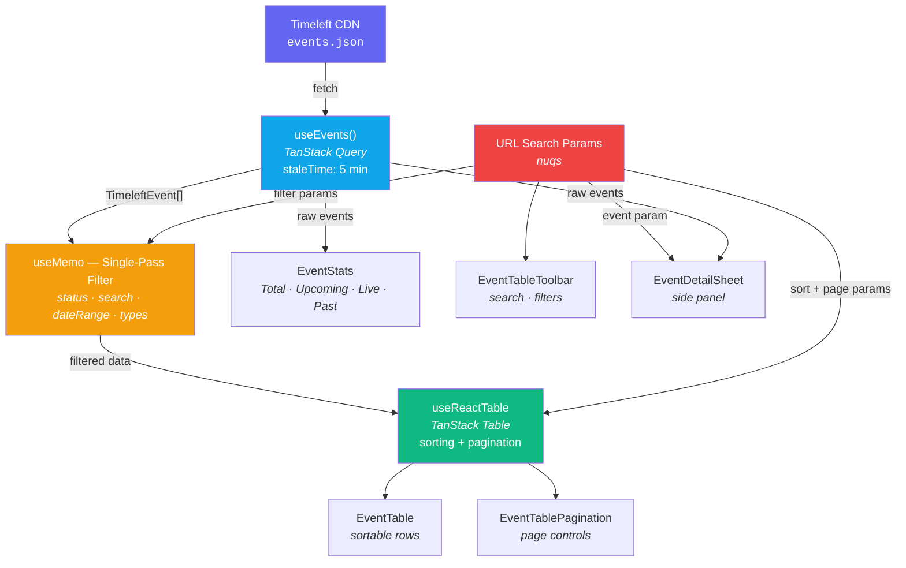
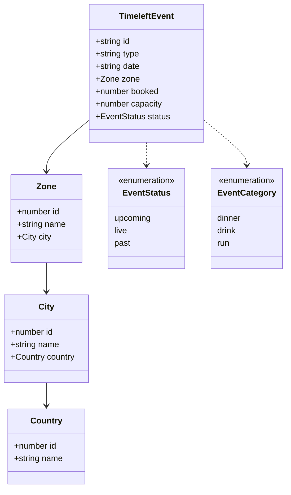
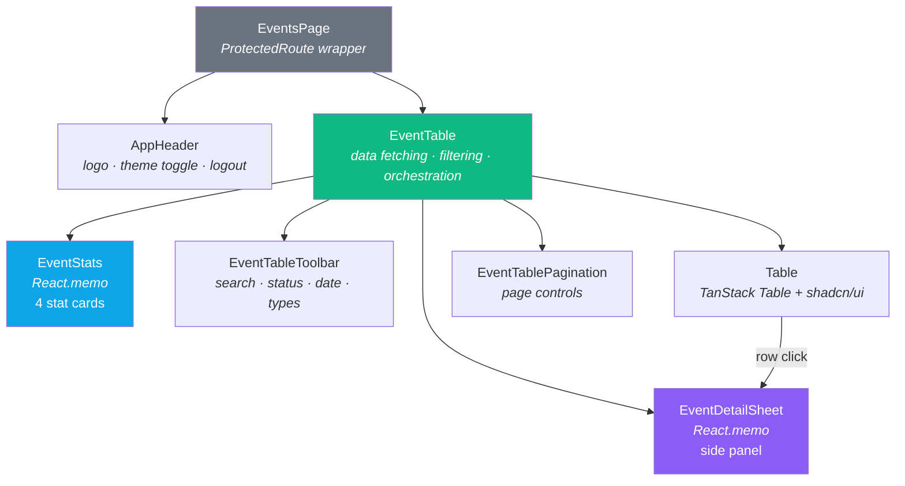
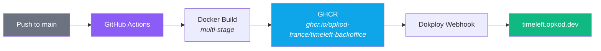

# Architecture

Detailed technical documentation for the Timeleft Back-Office application.

---

## Table of Contents

- [Provider Hierarchy](#provider-hierarchy)
- [Directory Structure](#directory-structure)
- [Routing & Authentication](#routing--authentication)
- [Data Flow](#data-flow)
  - [Fetch → Filter → Render Pipeline](#fetch--filter--render-pipeline)
  - [URL State](#url-state)
  - [Data Model](#data-model)
- [State Management](#state-management)
- [Component Architecture](#component-architecture)
- [Features Breakdown](#features-breakdown)
- [Key Decisions](#key-decisions)
- [Deployment](#deployment)

---

## Provider Hierarchy

The root layout (`app/layout.tsx`) wraps the entire app in three nested providers. An inline `<script>` in `<head>` applies the theme before React hydrates to prevent flash of wrong theme.

```
<html>
  └─ ThemeProvider ─────────── light / dark / system (localStorage + cross-tab sync)
       └─ QueryProvider ────── TanStack Query client (5 min staleTime, 1 retry)
            └─ NuqsAdapter ─── URL search param binding for Next.js App Router
                 └─ Pages
```

## Directory Structure

```
src/
├── app/
│   ├── layout.tsx              # Root layout with ThemeProvider + QueryProvider + NuqsAdapter
│   ├── page.tsx                # Redirects / → /login
│   ├── globals.css             # Tailwind config, CSS variables, custom animations
│   ├── login/
│   │   └── page.tsx            # Login page (client component)
│   └── events/
│       └── page.tsx            # Events dashboard (wrapped in ProtectedRoute)
├── features/events/
│   ├── types.ts                # TimeleftEvent, Zone, City, Country, EventStatus, EventCategory
│   ├── api.ts                  # useEvents() — TanStack Query hook fetching from CDN
│   ├── helpers.ts              # fillRate(), statusLabel, statusConfig, categoryConfig
│   ├── search-params.ts        # nuqs parser definitions for all URL state
│   └── components/
│       ├── event-stats.tsx             # Statistics cards (Total, Upcoming, Live, Past)
│       ├── event-table.tsx             # Main table orchestrator — fetching, filtering, rendering
│       ├── event-table-columns.tsx     # TanStack Table column definitions
│       ├── event-table-toolbar.tsx     # Search input + status filter + date range + type filter
│       ├── event-table-pagination.tsx  # Page controls + page size selector
│       └── event-detail-sheet.tsx      # Side panel for event details
├── components/
│   ├── app-header.tsx          # Top navigation bar (logo, theme toggle, logout)
│   ├── protected-route.tsx     # Auth guard — redirects to /login if not authenticated
│   ├── theme-toggle.tsx        # Dark/light mode toggle button
│   └── ui/                     # shadcn/ui primitives (badge, button, card, table, sheet, etc.)
├── providers/
│   ├── query-provider.tsx      # TanStack Query client configuration
│   └── theme-provider.tsx      # Theme context with localStorage persistence + cross-tab sync
└── lib/
    └── utils.ts                # cn() — clsx + tailwind-merge utility
```

---

## Routing & Authentication

| Route | Component | Type | Purpose |
|-------|-----------|------|---------|
| `/` | `Home` | Server | `redirect("/login")` |
| `/login` | `LoginPage` | Client | Email + password form with demo credentials |
| `/events` | `EventsPage` | Client | Events dashboard wrapped in `ProtectedRoute` |

Authentication is a simple `localStorage` flag (`timeleft-auth = "1"`). `ProtectedRoute` checks this flag on mount and redirects to `/login` if absent. This is a demo/internal tool — production would use OAuth or JWT.

**Demo credentials:** `admin@timeleft.com` / `timeleft2025`

---

## Data Flow

### Fetch → Filter → Render Pipeline



**Key points:**
- The CDN returns a static JSON file — all filtering, sorting, and pagination happen client-side
- Filtering uses a **single `for...of` loop** with early `continue` (no chained `.filter()`)
- Type filtering uses a `Set` for O(1) lookup instead of `Array.includes()`
- `EventStats` receives raw (unfiltered) events to show overall counts
- `EventDetailSheet` looks up events by ID via a `Map` (O(1) vs `.find()`)

### URL State

Every piece of table state is persisted as a URL search parameter via `nuqs`. This means every view is **bookmarkable**, **shareable**, and **refresh-safe**.

| Param | Default | Controlled by |
|-------|---------|---------------|
| `page` | `1` | Pagination controls |
| `perPage` | `20` | Page size selector |
| `sort` | `"date"` | Table header clicks |
| `order` | `"asc"` | Table header clicks |
| `status` | `""` | Status dropdown |
| `search` | `""` | Search input |
| `dateFrom` | `null` | Date range picker |
| `dateTo` | `null` | Date range picker |
| `types` | `[]` | Type filter |
| `event` | `""` | Row click → detail sheet |

### Data Model



---

## State Management

The app uses a layered state management approach — each layer owns a specific concern.

| Layer | Technology | What it manages |
|-------|-----------|----------------|
| Server state | TanStack Query | Remote data cache, background refetch, loading/error states |
| URL state | nuqs | Page, sort, order, status, search, dateFrom, dateTo, types, selected event |
| Client state | React useState | Password visibility, form submission state |
| Context state | ThemeProvider | Light/dark/system theme with `localStorage` persistence |
| Auth state | localStorage | Simple flag-based authentication (`timeleft-auth`) |

---

## Component Architecture



`EventTable` is the central orchestrator: it owns the TanStack Query hook, manages filtering via `useMemo`, configures the TanStack Table instance, and delegates rendering to child components.

---

## Features Breakdown

### Login Page

- Email + password form with validation (React Hook Form)
- Demo credentials auto-fill button
- Password visibility toggle
- Theme toggle (top-right corner)
- Animated entrance (`animate-fade-up`)

### Events Dashboard

- **Statistics cards** — Total, Upcoming, Live (with pulsing dot), Past counts + average fill rate
- **Sortable columns** — Date, Booked (fill rate), Status toggle asc/desc on header click
- **Status filter** — Dropdown to filter by upcoming, live, or past
- **Type filter** — Multi-select for dinner, drink, run (with category icons + colors)
- **Date range picker** — Calendar-based from/to date filtering
- **Text search** — Filters across event type, city, country, and zone name
- **Pagination** — Configurable page size (10/20/50) with first/prev/next/last navigation
- **Loading skeletons** — Skeleton placeholders while data loads
- **Error state** — Error display with retry button on fetch failure
- **Empty state** — Message when no events match filters

### Event Detail Sheet

- Opens as a **side panel** (sheet) when clicking a table row
- Displays full event details: type, date, location, capacity, fill rate, status
- Event ID stored in URL (`?event=...`) — deep-linkable
- Uses O(1) `Map` lookup by event ID

---

## Key Decisions

**URL as single source of truth** — Page number, sort column/direction, status filter, search query, date range, type filter, and selected event ID are all stored in URL search params via `nuqs`. Every table state is bookmarkable and shareable.

**Client-side filtering** — The API returns a static JSON file from a CDN, so all filtering, sorting, and pagination happen in the browser. TanStack Table handles sorting and pagination; filtering is done via `useMemo` on the raw data before passing it to the table.

**Sheet over modal** — Event details open in a side panel (sheet) rather than a centered modal. This keeps the table visible for context — critical for ops workflows where you're scanning through events.

**Feature-scoped directory** — All event-related code lives under `src/features/events/` to co-locate types, hooks, helpers, and components. Shared UI primitives stay in `src/components/ui/`.

**No backend API** — The app fetches from a static CDN endpoint (`cdn.timeleft.com`). TanStack Query handles caching (5-minute `staleTime`), error states, and background refetch.

---

## Deployment

**Pipeline:** GitHub Actions → Docker (GHCR) → Dokploy



**Docker image:** Multi-stage build (deps → builder → runner) on Node 22 Alpine with non-root user. Next.js `output: "standalone"` produces a self-contained `server.js`.

**Files:**
- `.github/workflows/deploy.yml` — Build, push to GHCR, trigger Dokploy webhook
- `Dockerfile` — Multi-stage production build
- `.dockerignore` — Excludes node_modules, .next, .env, .git

**Secret required:** `DOKPLOY_WEBHOOK_URL` (set in GitHub repo settings)
