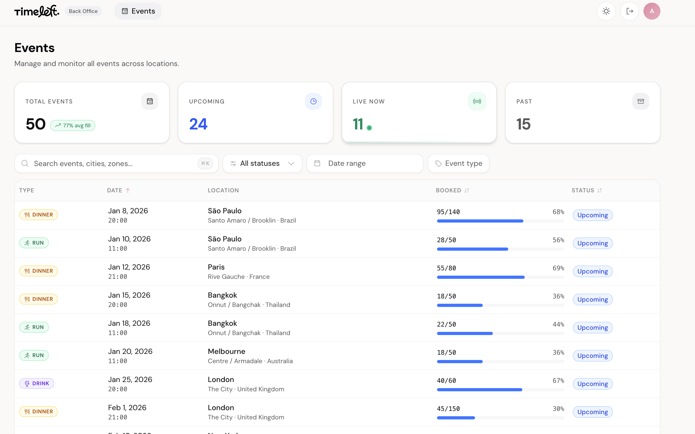
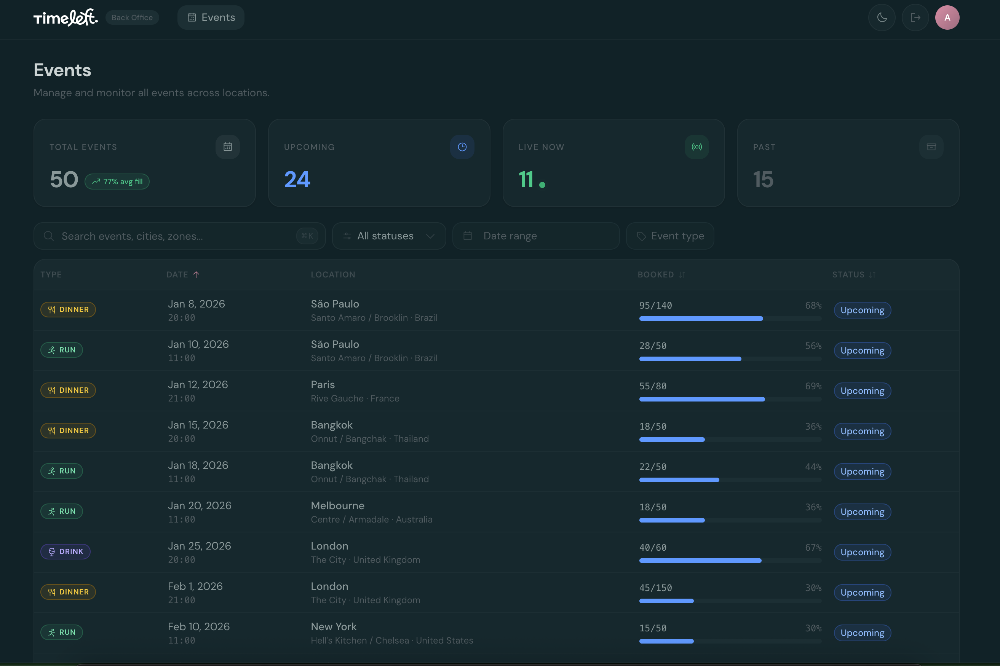

# Timeleft Back-Office


Internal back-office dashboard for the Timeleft operations team to manage and monitor events.

### Light mode



### Dark mode



### Event detail sheet


## Prerequisites

- [Node.js](https://nodejs.org/) **22+** — managed via [asdf](https://asdf-vm.com/) (recommended) or `.nvmrc`
- npm 10+

## Quick Start

```bash
npm install
npm run dev
```

Open [localhost:3000](http://localhost:3000) and sign in with the demo account:

| | |
|---|---|
| **Email** | `admin@timeleft.com` |
| **Password** | `timeleft2025` |

> **Note:** Authentication is static — credentials are hardcoded client-side and not connected to any user database. This is intentional for demo consistency; production would use a proper auth provider.

## Tech Stack

- [Next.js 16](https://nextjs.org/) — App Router, standalone output
- [Tailwind CSS v4](https://tailwindcss.com/) — Utility-first styling with OKLch theming
- [shadcn/ui](https://ui.shadcn.com/) — Accessible UI primitives (Radix + Tailwind)
- [TanStack Table v8](https://tanstack.com/table) — Headless table with sorting and pagination
- [TanStack Query v5](https://tanstack.com/query) — Data fetching, caching, background refetch
- [nuqs](https://nuqs.47ng.com/) — Type-safe URL search params for Next.js
- [React Hook Form](https://react-hook-form.com/) — Performant form handling
- [Phosphor Icons](https://phosphoricons.com/) — Flexible icon library
- [date-fns](https://date-fns.org/) — Lightweight date utilities

## Routes

| Route | Purpose |
|-------|---------|
| `/` | Redirects to `/login` |
| `/login` | Static demo login |
| `/events` | Events dashboard (protected) |

## Features

- **Statistics cards** — Total, Upcoming, Live, Past counts + average fill rate
- **Sortable table** — Date, Booked, Status columns with asc/desc toggle
- **Filters** — Status dropdown, type multi-select, date range picker, text search
- **Pagination** — Configurable page size (10/20/50)
- **Event detail sheet** — Side panel on row click, deep-linkable via URL
- **URL sync** — All table state in URL params — bookmarkable, shareable, refresh-safe
- **Dark mode** — Solarized-inspired theme with cross-tab sync

## Project Structure

```
src/
├── app/                    # Pages & layouts
│   ├── login/              # Login page
│   └── events/             # Events dashboard
├── features/events/        # Domain logic (types, api, helpers, components)
├── components/             # Shared components (header, auth guard, ui primitives)
├── providers/              # ThemeProvider, QueryProvider
└── lib/                    # Utilities (cn)
```

## Key Decisions

- **URL as single source of truth** — Every table state is a search param via `nuqs`
- **Client-side filtering** — Static CDN data, all filtering/sorting/pagination in browser
- **Sheet over modal** — Event details in side panel to keep table visible
- **Feature-scoped directory** — All event code co-located under `src/features/events/`

## Deployment

Pushes to `main` trigger an automated pipeline:

1. **GitHub Actions** builds a Docker image (multi-stage, Node 22 Alpine)
2. **GHCR** hosts the image at `ghcr.io/opkod-france/timeleft-backoffice`
3. **Dokploy** pulls and deploys via webhook to `timeleft.opkod.dev`

See the [architecture guide](./ARCHITECTURE.md) for the full pipeline details, secrets setup, and local Docker build instructions.

## Detailed Documentation

For in-depth coverage — data flow diagrams, state management breakdown, component tree, data model, and deployment pipeline — see the [architecture guide](./ARCHITECTURE.md).
