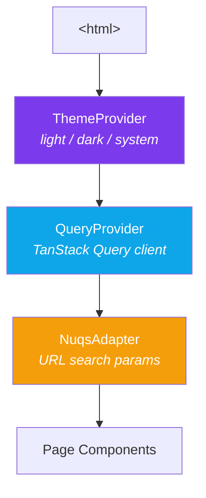
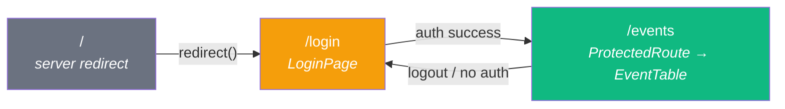
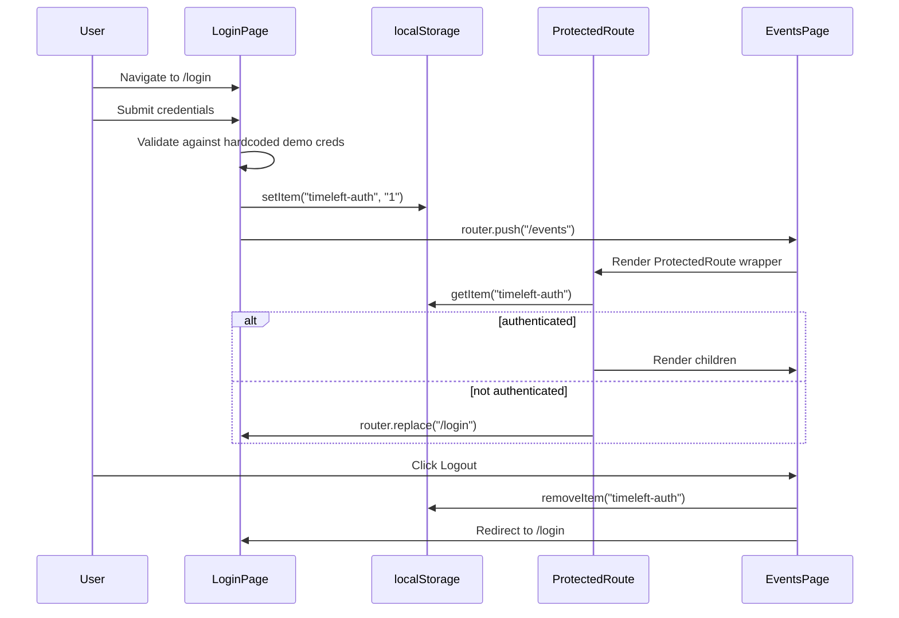
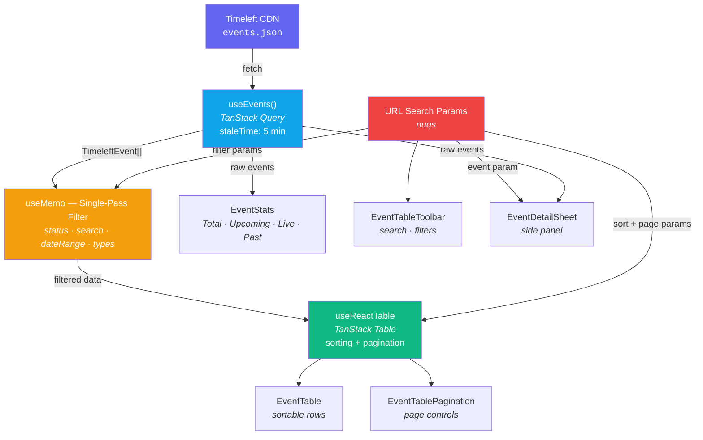
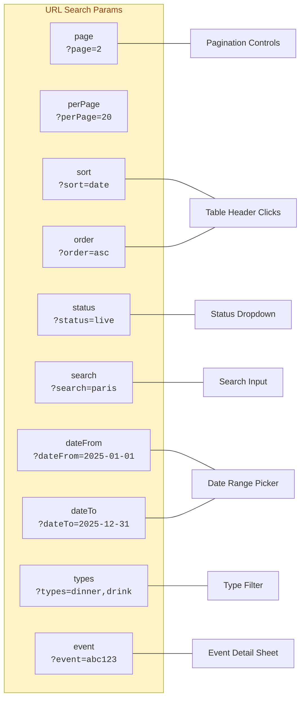
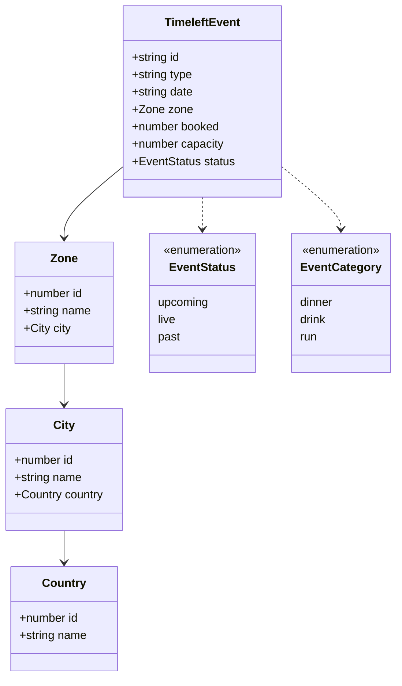
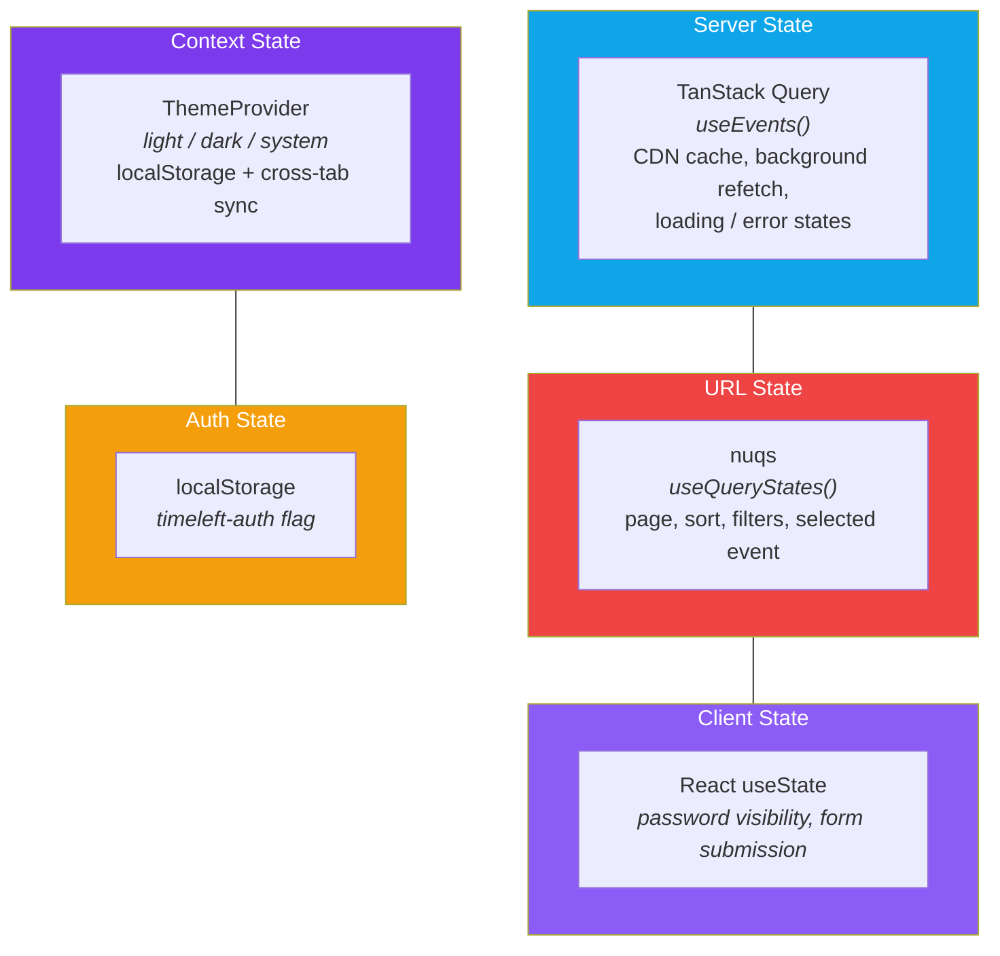
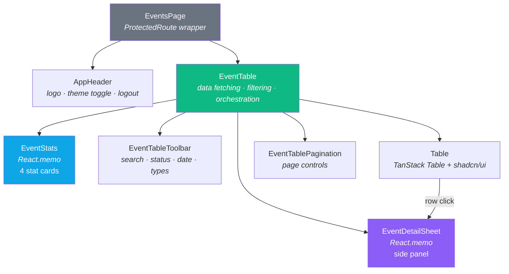
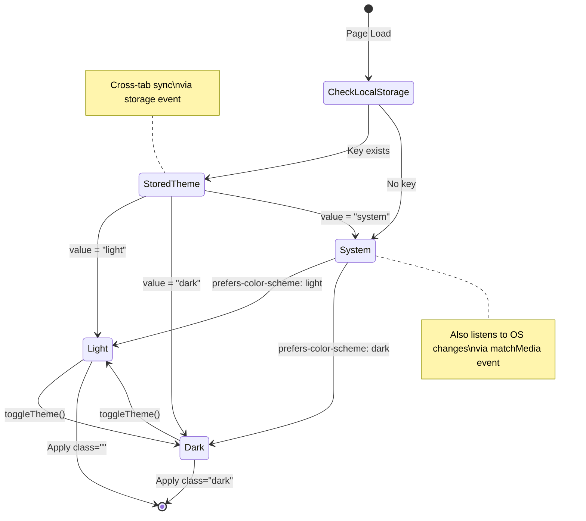
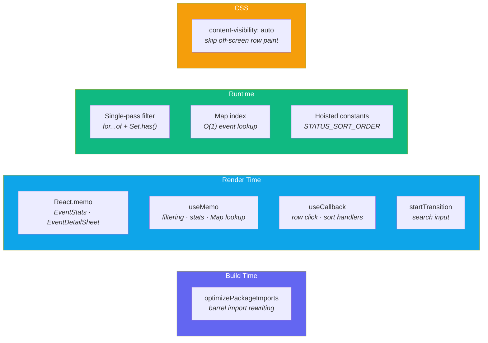

# Timeleft Back-Office — Event Management Dashboard

Internal back-office application for the Timeleft operations team to manage and monitor events.

---

## Table of Contents

- [Running the Project](#running-the-project)
- [Tech Stack](#tech-stack)
- [Architecture Overview](#architecture-overview)
  - [Provider Hierarchy](#provider-hierarchy)
  - [Directory Structure](#directory-structure)
- [Routing & Navigation](#routing--navigation)
  - [Route Map](#route-map)
  - [Authentication Flow](#authentication-flow)
- [Data Flow](#data-flow)
  - [Fetch → Filter → Render Pipeline](#fetch--filter--render-pipeline)
  - [URL as Single Source of Truth](#url-as-single-source-of-truth)
  - [Data Model](#data-model)
- [State Management](#state-management)
- [Features](#features)
  - [Login Page](#login-page)
  - [Events Dashboard](#events-dashboard)
  - [Event Detail Sheet](#event-detail-sheet)
- [Component Architecture](#component-architecture)
  - [Events Page Component Tree](#events-page-component-tree)
- [Styling & Theming](#styling--theming)
  - [Theme System](#theme-system)
- [Performance Optimisations](#performance-optimisations)
- [Key Decisions](#key-decisions)

---

## Running the Project

```bash
npm install
npm run dev
```

Open [http://localhost:3000](http://localhost:3000) — the root `/` redirects to `/login`. After authentication, you reach `/events`.

---

## Tech Stack

| Concern | Choice | Rationale |
|---------|--------|-----------|
| Framework | **Next.js 16** (App Router) | Server components for layout, client components for interactive UI |
| UI Components | **shadcn/ui** | Composable Radix primitives with Tailwind — zero runtime cost, full control |
| Data Table | **TanStack Table v8** | Headless, type-safe table logic (sorting, pagination) |
| Data Fetching | **TanStack Query v5** | Client-side cache, stale-while-revalidate, loading/error states |
| URL State | **nuqs** | Type-safe search param management for Next.js App Router |
| Forms | **React Hook Form** | Performant form state management (login page) |
| Date Formatting | **date-fns** | Tree-shakeable, functional date utilities |
| Icons | **Phosphor Icons** | Flexible icon library with multiple weights |
| Styling | **Tailwind CSS v4** | Utility-first CSS with OKLch color space |

---

## Architecture Overview

### Provider Hierarchy

The root layout wraps the entire app in three nested providers.



An inline `<script>` in `<head>` reads the theme from `localStorage` before React hydrates, preventing flash of wrong theme (FOWT).

### Directory Structure

```
src/
├── app/
│   ├── layout.tsx              # Root layout with ThemeProvider + QueryProvider + NuqsAdapter
│   ├── page.tsx                # Redirects / → /login
│   ├── globals.css             # Tailwind config, CSS variables, custom animations
│   ├── login/
│   │   └── page.tsx            # Login page (client component)
│   └── events/
│       └── page.tsx            # Events dashboard (wrapped in ProtectedRoute)
├── features/events/
│   ├── types.ts                # TimeleftEvent, Zone, City, Country, EventStatus, EventCategory
│   ├── api.ts                  # useEvents() — TanStack Query hook fetching from CDN
│   ├── helpers.ts              # fillRate(), statusLabel, statusConfig, categoryConfig
│   ├── search-params.ts        # nuqs parser definitions for all URL state
│   └── components/
│       ├── event-stats.tsx             # Statistics cards (Total, Upcoming, Live, Past)
│       ├── event-table.tsx             # Main table orchestrator — fetching, filtering, rendering
│       ├── event-table-columns.tsx     # TanStack Table column definitions
│       ├── event-table-toolbar.tsx     # Search input + status filter + date range + type filter
│       ├── event-table-pagination.tsx  # Page controls + page size selector
│       └── event-detail-sheet.tsx      # Side panel for event details
├── components/
│   ├── app-header.tsx          # Top navigation bar (logo, theme toggle, logout)
│   ├── protected-route.tsx     # Auth guard — redirects to /login if not authenticated
│   ├── theme-toggle.tsx        # Dark/light mode toggle button
│   └── ui/                     # shadcn/ui primitives (badge, button, card, table, sheet, etc.)
├── providers/
│   ├── query-provider.tsx      # TanStack Query client configuration
│   └── theme-provider.tsx      # Theme context with localStorage persistence + cross-tab sync
└── lib/
    └── utils.ts                # cn() — clsx + tailwind-merge utility
```

---

## Routing & Navigation

### Route Map



| Route | Component | Type | Purpose |
|-------|-----------|------|---------|
| `/` | `Home` | Server | `redirect("/login")` |
| `/login` | `LoginPage` | Client | Email + password form with demo credentials |
| `/events` | `EventsPage` | Client | Events dashboard wrapped in `ProtectedRoute` |

### Authentication Flow



Authentication is a simple `localStorage` flag (`timeleft-auth = "1"`). This is a demo/internal tool — production would use OAuth or JWT.

**Demo credentials:** `admin@timeleft.com` / `timeleft2025`

---

## Data Flow

### Fetch → Filter → Render Pipeline



**Key points:**
- The CDN returns a static JSON file — all filtering, sorting, and pagination happen client-side
- Filtering uses a **single `for...of` loop** with early `continue` (no chained `.filter()`)
- Type filtering uses a `Set` for O(1) lookup instead of `Array.includes()`
- `EventStats` receives raw (unfiltered) events to show overall counts
- `EventDetailSheet` looks up events by ID via a `Map` (O(1) vs `.find()`)

### URL as Single Source of Truth

Every piece of table state is persisted as a URL search parameter via `nuqs`.



This means every table state is **bookmarkable**, **shareable**, and **refresh-safe**.

### Data Model



---

## State Management

The app uses a layered state management approach — each layer owns a specific concern.



| Layer | Technology | What it manages |
|-------|-----------|----------------|
| Server state | TanStack Query | Remote data cache, background refetch, loading/error states |
| URL state | nuqs | Page, sort, order, status, search, dateFrom, dateTo, types, selected event |
| Client state | React useState | Password visibility, form submission state |
| Context state | ThemeProvider | Light/dark/system theme with `localStorage` persistence |
| Auth state | localStorage | Simple flag-based authentication (`timeleft-auth`) |

---

## Features

### Login Page

- Email + password form with validation (React Hook Form)
- Demo credentials auto-fill button
- Password visibility toggle
- Theme toggle (top-right corner)
- Animated entrance (`animate-fade-up`)
- Version display at bottom

### Events Dashboard

- **Statistics cards** — Total, Upcoming, Live (with pulsing dot), Past counts + average fill rate
- **Sortable columns** — Date, Booked (fill rate), Status toggle asc/desc on header click
- **Status filter** — Dropdown to filter by upcoming, live, or past
- **Type filter** — Multi-select for dinner, drink, run (with category icons + colors)
- **Date range picker** — Calendar-based from/to date filtering
- **Text search** — Filters across event type, city, country, and zone name
- **Pagination** — Configurable page size (10/20/50) with first/prev/next/last navigation
- **Loading skeletons** — Skeleton placeholders while data loads
- **Error state** — Error display with retry button on fetch failure
- **Empty state** — Message when no events match filters

### Event Detail Sheet

- Opens as a **side panel** (sheet) when clicking a table row
- Displays full event details: type, date, location, capacity, fill rate, status
- Event ID stored in URL (`?event=...`) — deep-linkable
- Uses O(1) `Map` lookup by event ID (not `.find()`)

---

## Component Architecture

### Events Page Component Tree



`EventTable` is the central orchestrator: it owns the TanStack Query hook, manages filtering via `useMemo`, configures the TanStack Table instance, and delegates rendering to child components.

---

## Styling & Theming

| Aspect | Implementation |
|--------|---------------|
| Framework | Tailwind CSS v4 with PostCSS |
| Color space | OKLch (perceptually uniform) |
| Brand color | `--brand-pink` (oklch(0.76 0.11 0)) |
| Display font | DM Sans (700 weight, tight letter-spacing) |
| Data font | JetBrains Mono (tabular numbers) |
| Component variants | class-variance-authority (CVA) |
| Class merging | tailwind-merge via `cn()` utility |
| Custom animations | `animate-fade-up`, `animate-fade-in`, `animate-scale-in` with stagger classes |

### Theme System



The theme provider:
- Persists preference to `localStorage` as `timeleft-theme`
- Syncs across browser tabs via `StorageEvent`
- Listens for OS preference changes when set to "system"
- An inline `<script>` in `layout.tsx` applies the theme before React hydrates to prevent FOWT

---

## Performance Optimisations



| # | Optimisation | Where | Impact |
|---|-------------|-------|--------|
| 1 | **`optimizePackageImports`** | `next.config.ts` | Rewrites barrel imports for Phosphor Icons, date-fns, Radix UI — reduces bundle size, faster dev boot |
| 2 | **Single-pass filtering** | `event-table.tsx` | One `for...of` loop with early `continue` instead of chained `.filter()` — avoids intermediate arrays |
| 3 | **Set-based type lookup** | `event-table.tsx` | `Set.has()` (O(1)) replaces `Array.includes()` (O(n)) for type filtering |
| 4 | **Single-pass stats** | `event-stats.tsx` | One loop computes all counts + avg fill rate instead of 3x `.filter()` + 1x `.reduce()` |
| 5 | **React.memo** | `event-stats.tsx`, `event-detail-sheet.tsx` | Skips re-render when props unchanged (common during filter/sort/page changes) |
| 6 | **Map index for detail lookup** | `event-detail-sheet.tsx` | `Map<string, Event>` built once per fetch — O(1) lookup vs O(n) `.find()` |
| 7 | **Functional setState** | `theme-provider.tsx`, `login/page.tsx` | Eliminates state from `useCallback` deps → permanently stable references |
| 8 | **startTransition** | `event-table-toolbar.tsx` | Marks search-triggered table re-render as non-urgent — keeps input responsive |
| 9 | **content-visibility: auto** | `globals.css` + table rows | Browser skips layout/paint for off-screen rows |
| 10 | **Hoisted constants** | `event-table-columns.tsx` | `STATUS_SORT_ORDER` at module scope — avoids per-comparison allocation in sort function |

---

## Key Decisions

**URL as single source of truth** — Page number, sort column/direction, status filter, search query, date range, type filter, and selected event ID are all stored in URL search params via `nuqs`. Every table state is bookmarkable and shareable.

**Client-side filtering** — The API returns a static JSON file from a CDN, so all filtering, sorting, and pagination happen in the browser. TanStack Table handles sorting and pagination; filtering is done via `useMemo` on the raw data before passing it to the table.

**Sheet over modal** — Event details open in a side panel (sheet) rather than a centered modal. This keeps the table visible for context — critical for ops workflows where you're scanning through events.

**Feature-scoped directory** — All event-related code lives under `src/features/events/` to co-locate types, hooks, helpers, and components. Shared UI primitives stay in `src/components/ui/`.

**No backend API** — The app fetches from a static CDN endpoint (`cdn.timeleft.com`). TanStack Query handles caching (5-minute `staleTime`), error states, and background refetch.
